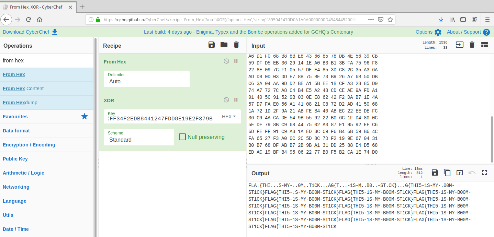
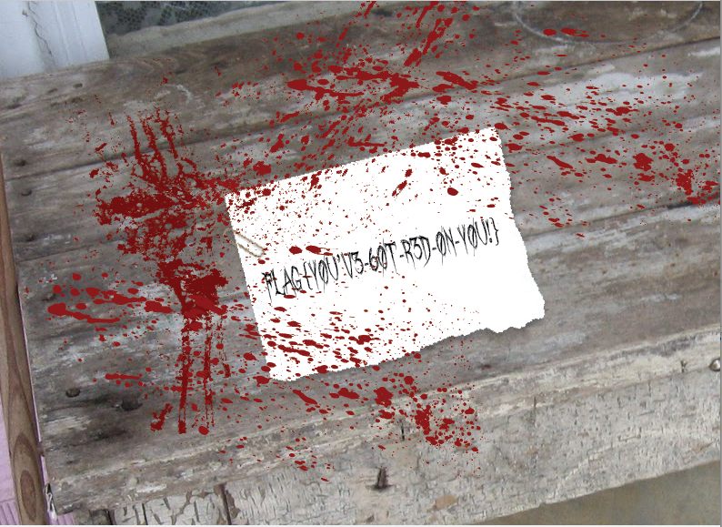
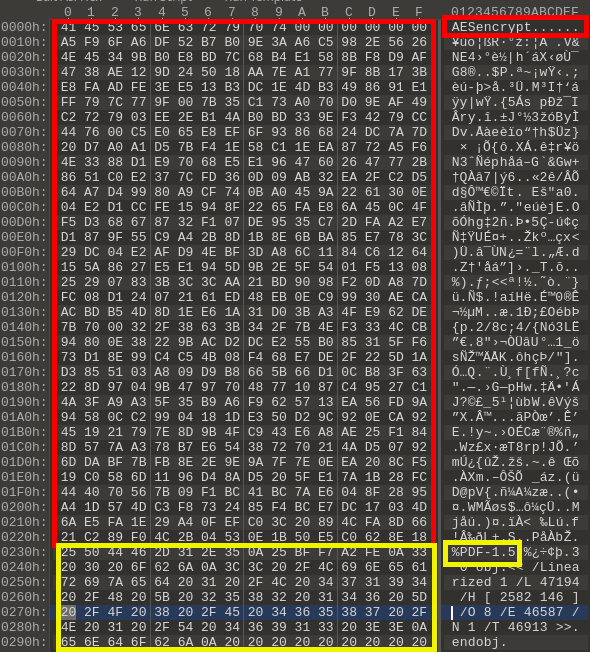
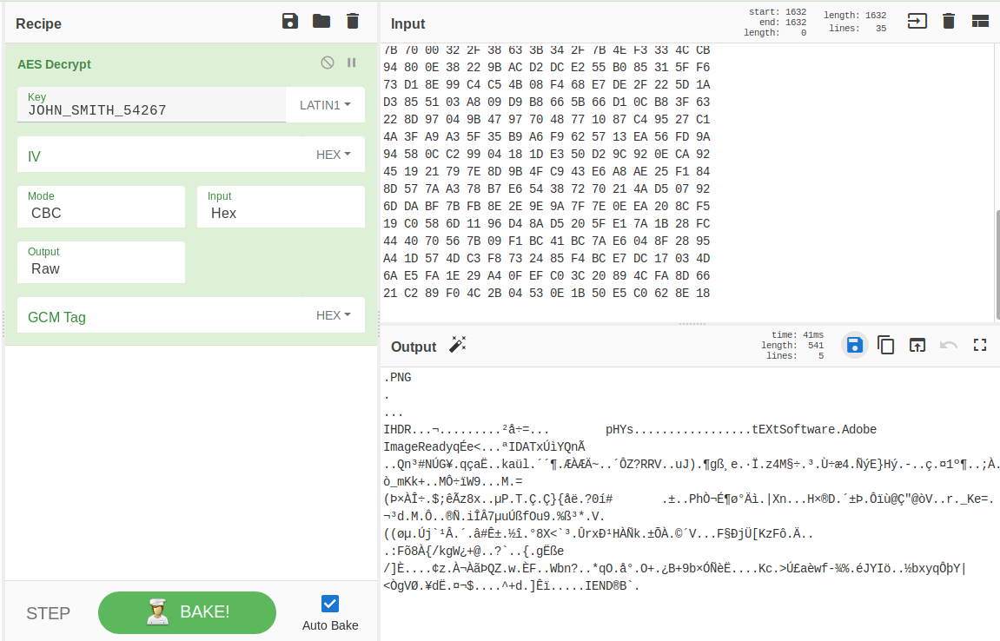
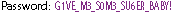
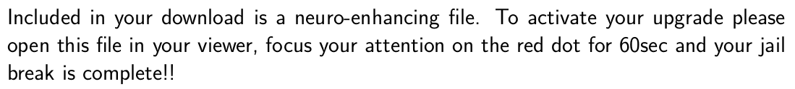
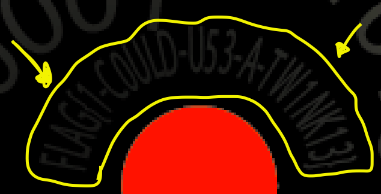

## Challenge Scenario
Our first subject is as follows;

* __Subject__: John Smith
* __Age__: 27
* __Occupation__: None on record.
* __Installed implant features or upgrades:] None on record.
* __Background__: Friends and family of John describe him as a fun and outgoing guy, however his ease to anger made it hard for him to hold down a job of any length of time. It was reported that in the last month of his life John has lost his best friend Brent in a climbing accident. John carried Brent’s body back to the hunting cabin where they were staying and remained with his body for 5 days before rangers could evacuate them. This incident had thrown John into a deep depression, he became obsessed with his implant and spent most of his time retreating into his neuro interface.
* __Known circumstances of death__: Witnesses say subject seemed to _zone out_ like he was re-watching an internal memory, then dropped and began to foam at the mouth. Subject without a pulse when first responders arrived.
* __Objective__: Find the memory that caused John to retreat, determine and investigate the cause of death.
* __Password__: DEFEC8ED


This challenge contained two files: 

1. DEFEC8ED.zip
1. JSmith-PBRG4JH2DGK\_04-20-2019.log

## Solution

For the purposes of this challenge the log file included with the challenge can be ignored, as it holds no vital information needed to solve this challenge. This challenge actually contained 4 flags in total, as such this walk-through is broken into sections based on the flag it is solving.

## FLAG 1
Finding this flag is fairly simple and can be accomplished many different ways. As I am partial to 010Editor this walk-through will show only this method of solving the challenge. 

Immediately on opening the file in a hexeditor we can see that we are dealing with a FAT16 Filesystem.

[FAT](img/FAT.png "Identifying the Filesystem")


010Editor has some very convenient templates in its repository, if not all ready installed, install the Drive.bt template. This can be done by selecting __*Templates->Template Repository*__ this will open a window displaying all available templates. Select _Drive.bt_ from the drive category and then click the install button. Close the repository window and expand the __*Run Template*__ drop down above the raw Hex, select _Drive_ from this menu and 010Editor will automatically run the template on the file.

You can now navigate through the structures in the template output window and see the entire makeup of the filesystem.

[FAT](img/TemplateWindow.png "010Editor Template Window")

Exploring the __root\_dir__ we can see it contains 4 directories and 1 pdf:

* Documents/
* Downloads/
* EXTRA/
* Welcome/
* User-Guide.pdf

Expanding each __direntry__ then its __sub\_dir__ we can gain a view of the entire filesystem:

* Documents/
    * Image-001.crypt
    * Image-001.png (Erased)
* Downloads/
    * jailbreak
        * Ultimate\_Implant\_Jailbreak.pdf
        * UPGRADE.zip
* EXTRA/
    * FLAG\{H3AD-C0FF1N-PL3A53\}.odt (Erased)
* Welcome/
    * NewTaste.pdfNewTaste.pdf
    * UnderstandYourBaby.pdf 
    * Zoombies.pdf
    * CortexViper.pdf
    * Mindsweeper.pdf 
* User-Guide.pdf

Looks like we found our first flag! __FLAG\{H3AD-C0FF1N-PL3A53\}__. There are two deleted files in this filesystem, best to extract them before we mount the filesystem as we will no longer have access to them after mounting.

## Extracting Deleted files

All the information you need to extract what may be left of a deleted file can be found in its __short\_entry__. We don't even need to do any cluster calculations as 010Editors Drive template has already marked the first cluster that used for the file before it was deleted. Expanding the __short\_entry__ we can retrieve the original size of the file. It's worth noting here that in a FAT filesystem (especially one that does not receive a lot of writes) the difference between a file and a deleted file is an 0xE5 at the beginning of it's short and long directory entry nodes. It's also worth noting that the FAT filesystem attempts to be sequential wherever it can, a file is only fragmented if there is not a sequential space large enough to hold it. With this knowledge we can extract the deleted files using the following steps:

1. Expand the __direntry__ of the deleted file.
1. Expand the __short\_entry__ for the deleted file and note the value of the __FileSizeInBytes__ element.
1. Select the __possibleDeletedData__ element of __direntry__. This will navigate the main window to the first cluster that was associated with this file.
1. Select the first byte of the highlight cluster in the main window.
1. Select __*Edit-$>$Select Range*__ from the main menu. This will cause the select bar to open with the _Start_ element already set to the beginning of the desired cluster. Make sure the __Options__ is set to _Specify Range using Start Address \+ Size_ and input the size-in-bytes retrieved from the __short\_entry__. Press enter, this will cause the entire size of the deleted file to be selected from the file sequentially.
1. Select __*File-$>$Save Selection*__ from the main menu and save your file with its deleted name and extension.

You can gaine comfort that the data looking at could potentially be the deleted file you want, by paying attention to the magic (file signature) in the first cluster. If you are extracting the __.odt__ file the magic should be 0x504B0304 (or _PK.._) as odt files are stored in a zip compressed format. Where as if you are extracting the Image-001.png file you should see 0x89504E47 (or _.PNG_) as this is the file signature (magic) for a PNG file.

## Mounting the Filesystem

Now that you have the deleted files you are safe to mount the filesystem for easer access to the remaining files. To do this in Linux create a directory to mount the filesystem too then mount using the following command:
```
    sudo mount DEFEC8ED.bin <Path the directory you created>
```
If you are using Windows simply unzip the DEFEC8ED.bin using 7zip and 7zip will auto mount it for you.

## FLAG 2 & 3

The objective of this challenge asked us to "_Find the memory that caused John to retreat..._". We are already aware of the deleted PNG file and given that the rest of his filesystem seems to be pretty stock other then a jailbreak download, it's pretty safe to assume that we need to decrypt the the Image-001.crypt file to see this memory he keeps retreating too.

If we remember from the previous section we extracted a deleted PNG called Image-001.png, but if we open it its pretty much just black with some streaking color at the very top. Opening the Image-001.png in a hexeditor shows that only the first 512 bytes are valid the remaining bytes of the file are all 0x00.

So we know what the first section of the PNG should look like when it is decrypted, we don't have a key and looking at the hex of the encrypted image gives no real information as to how it might be encrypted. So lets open up GCHQ's  and see if we can combine the encrypted file and decrypted file part in anyway to perhaps derive the key.  

Since we want to be able to see whats going on without having download a bunch of files lets just use the first 512 bytes if the encrypted file. The simplest form of encryption is XOR so lets start there!



Well XOR seems to be correct we managed to pull the XOR key and it looks to be a flag as well __FLAG\{THI5-1S-MY-B00M-ST1CK\}__. However, they did ask for the memory so lets go a head and decrypt Image-001.crypt now that we have the key and see what John was looking at.



It's a good thing we are nosy or we might have missed this one! __FLAG\{Y0U'V3-60T-R3D-0N-Y0U!\}__.

## FLAG 4
The second half of the objecting says "_...determine and investigate the cause of death._" Well it's not hard to imagine a jailbreak going very wrong so lets take a look a closer look at the downloads directory.

This directory gives us two files an archive called __UPGRADE.zip__ and a PDF called __Ultimate\_Implant\_Jailbreak.pdf__. Looking at the PDF this hack seems to good to be true! Though it seems John did not take note of the warning at the bottom of the page:

```
Warning: The use of the Ultimate Implant Jailbreak is done solely at the users own risk. The Hack your Brain Group takes no responsibility for faulty upgrade attempts or any unexpected results. Hack your Brain is in no way associated with NeuroSoft.
```

The UPGRADE.zip file is password encrypted so again we are looking for a password. If you remember the first flag was the name of a deleted _.odt_ file but we have yet to actually look at that file and see what was in it. 
When we do we can see it contains the following:

```
    1 OF 4 - PW for AES = JOHN_SMITH_54267
```

Well that document was the first of four flags, but now we have an AES password as well. Unfortunately, this is not the password for the zip file, the only other files in the system are the stock PDFs that come with the NeuroSoft Beyond Reality device (User Guid and the files in the welcome folder) and the jailbreak PDF. Given that the UPGRADE.zip was probably password protected by the _Hack you Brain Group_ before John downloaded it. Lets look a little closer at the Ultimate\_Implant\_Jailbreak.pdf.

Opening the PDF up in a Hexeditor again we should expect to see the 0x25504440 (or _%PDF_) file signature (magic) at the beginning of the file, but we don't.



Looking at Figure 5 we can see that the actual PDF does not begin until address 0x230, and the 0x22F bytes before that are prefaced with "AESencrypt......" it seems this is what the AES Key was for. Given how the AES encryption algorithm works it's not likely to find clear plane text and repetitive values in the actual encrypted data, as such extract only the bytes beginning at address 0x0010 to 0x022F and leave the first 16 bytes of the encryption these are just a header. Again we head over to CyberChef, using the AES Decrypt operation as shown in Figure 6.



We can see from Figure 6 that the encrypted data was actually a PNG file (_Note the magic ```.PNG```_). From the __Output__ window menu select save output to file, CyberChef will automatically recognize the file as a PNG and apply the appropriate extension. When we open this file we see the following:



Seems we have discovered the password for the UPGRADE.zip. Extracting the UPGRADE.zip results UPGRADE.png.


Now before you freak out thinking you need to copy out all that binary and convert it to Ascii remember what the Ultimate\_Implant\_Jailbreak.pdf said about how to upgrade.



So maybe first take a closer look at that red dot.



There it is! the final flag! __FLAG\{1-C0ULD-U53-A-TW1NK13\}__

Congratulations, you have finished the first DEFEC8ED challenge. 
