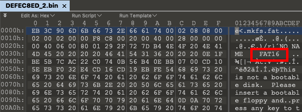
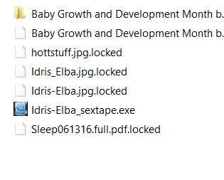
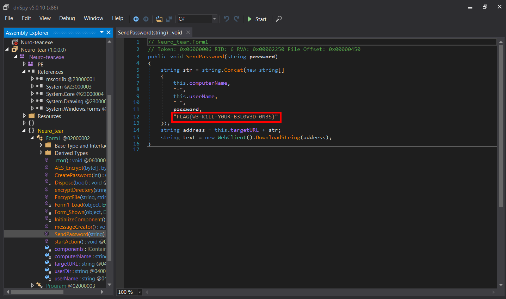
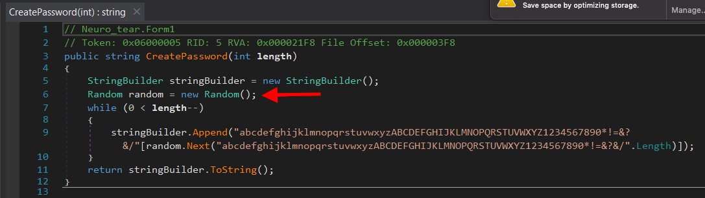
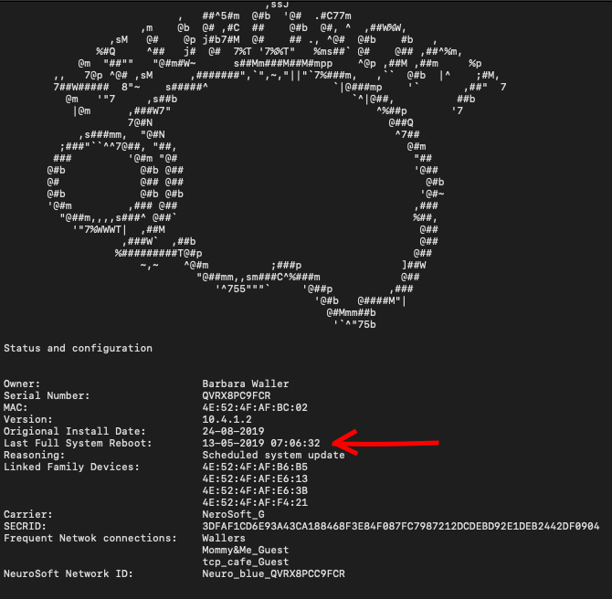

## Challenge Scenario

A new subject has been brought into the Forensic Coroner’s Office.
  
* __Subject__: Barbara Waller
* __Age__: 39
* __Occupation__: House Wife
* __Installed implant features or upgrades__: None on record.  
* __Background__: Barbara Waller is a mother of 3 children aged 4, 7, and 4 months, and married to Walter Waller, a financial analyst at Freemans Bank. 
* __Known circumstances of death__: Barbara is the first of a series of five other new mothers all belonging to the same “Mommy and Me” class that have died with eerily similar circumstances all within days/hours of each other. 
* __Objective__: Determine and investigate the cause of death, retrieve as much data as possible.
* __Special Note__: Due to the contagious nature of these deaths be VERY cautious in your investigation.
* __Password__: DEFEC8ED_2

This challenge contained two files: 

1. DEFEC8ED_2.zip
1. BWaller-QVRX8PCC9FCR_05-13-2019.log

## Solution

Unlike the first DEFEC8ED challenge the log file in this challenge holds some very important information, the full challenge can not be completed without it. This challenge contained 2 flags total, and came with a special note that should not be ignored!

## Checking the Filesystem

Like in the first DEFEC8ED challenge a quick look at the challenge in a hexeditor allows us to recognize the filesystem as a __FAT16__.



Again using 010Editor we can apply the Drive.bt template and get a look at what is in the filesystem before we mount.

* Welcome/
	* NewTaste.pdfNewTaste.pdf.locked
    * UnderstandYourBaby.pdf.locked 
    * Zoombies.pdf.locked
    * CortexViper.pdf.locked
    * Mindsweeper.pdf.locked 
* READ_IT.TXT
* User-Guide.pdf.locked
* Documents/
	* FlagFile.rtf.locked
	* PICS/
		* IMG_0214.jpg.locked
			.
			.
			.
		* IMG_0239.jpg.locked
	* txt_backup/
		* msg.txt.locked
	* Downloads/
		* 
		* hottstuff.jpg.locked 
		* Idris-Elba.jpg.locked
		* Idris-Elba_sextape.exe 
		* Idris_Elba.jpg.locked 
		* Sleep061316.full.pdf.locked 
		* Baby Growth and Development Month by Month What to Expect_files/
			* _lots of files_ 		

Surly some suspicious stuff but nothing deleted so lets go a head and mount for now.

## Exploring the Filesystem

Few things to note here:

1. We can see right off there is a file of interest in the _Documents_ folder, specifically FlagFile.rtf.locked.
2. Everything seems to have a _".locked"_ extension with the exception of 2 files READ\_IT.txt and Idris-Elba_sextape.exe
3. Even more suspicious when viewed from a windows VM (Be careful)

	

### READ_IT.txt

This file contained the following:
```
Files has been encrypted with NeuroTear
Pay 100 bitcoins or face full neuro shutdown
You have 24 hours to make this payment.
```
There is a big hint for you here. Anyone who was paying attention to the crypto malware attacks over 2018 might recognize a similarity between the name of this ransomware and a controversial release of ransomware source code on gitHub. 

### Idris-Elba_sextape.exe

Running the _file_ command on this file returns the following:
```
Idris-Elba_sextape.exe: PE32 executable (GUI) Intel 80386 Mono/.Net assembly, for MS Windows
```
Looks like we are pulling out the dnSpy. No attempt was made to obfuscate the malware so reversing it is pretty much like just reading the code! It does not take long to discover the _SendPassword()_ function with a little prize just for looking.



But there is more to this story, we still need to recover the _FlagFile.rtf.locked_ this is where the real points are earned.

## Decrypting the Filesystem

Explore on you own or do some quick research and you will discover that the weakness to this ransomware (and its variants) was the following:



The Random Class in .NET uses Environment.TickCount() as the seed, this is where that log file comes in handy.

  	

The log file gives the last time the system was rebooted, combining this with the last update time of the encrypted file we can narrow down the value of the Environment.TickCount at the time of encryption. This allows us to brute force a smaller window of possible seed values. The code for decrypting the files can be easily accessed if you have figured out by this point that you are dealing with a variant of __Hidden Tear__ crypto malware, as was noted the source is available on  

