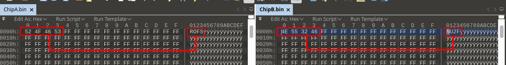
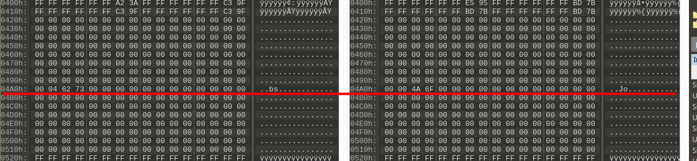
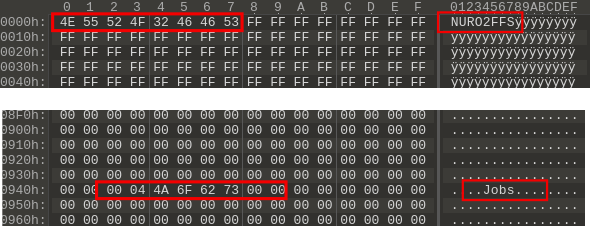
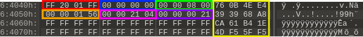
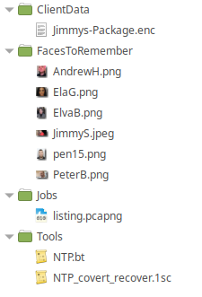
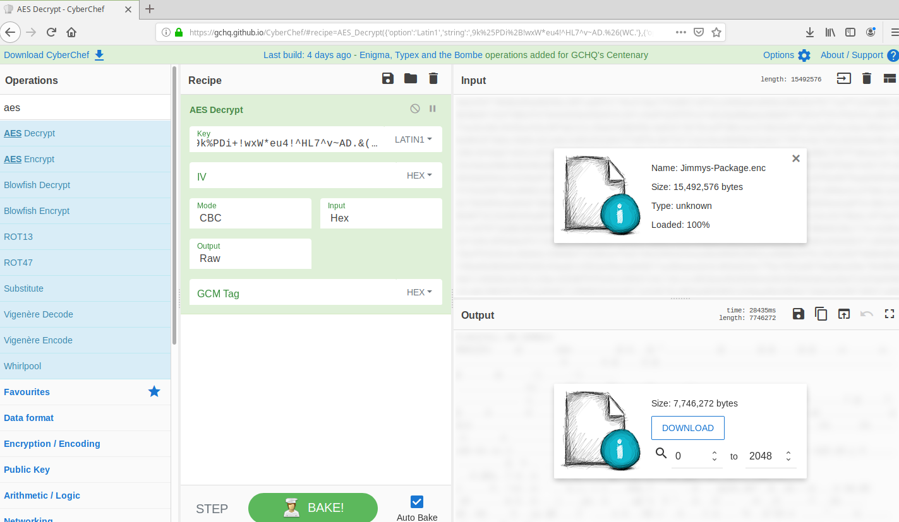
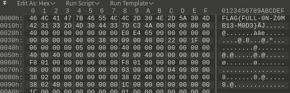

## Challenge Scenario
A VIP subject has been brought into the Forensic Coroner’s Office. This subject is of high interest to the police and has been marked priority one. This case is also a priority subject to us; any information you can extract on this could greatly help us. I’d also like to remind you that everything you are finding is considered highly confidential.

* __Subject:__ Tommy “Eighty Gigs” Gallo
* __Age:__ 42
* __Occupation:__ Assumed Data Courier for the Mob.
* __Installed implant features or upgrades:__ Subject appears to have a black-market memory expansion upgrade installed.
* __Background:__ According to police Tommy Gallo has strong ties to some high level operators in a wide spread organized crime syndicate.
* __Known circumstances of death:__ Tommy Gallo’s body was found washed up at Port Montreal. Further testing is needed to determine the subject’s time of death due to conflicting CCTV evidence showing the subject walking around and the amount of internal decay. Cause of death appears to be massive head trauma, though there is a high likelihood that the data from the subject implant is still recoverable. Its should also be noted that the subject has non-defensive wounds on both his hands and mouth, as well as a unusual blackening of the gums. Finally, the subject’s eyes show signs of severe cataracts, however his medical file indicates he had cataract surgery performed less then one year ago.
* __Objective:__ The police are extremely interested in the payload the subject was carrying, as well any information about his associates and how they are communicating.
* __Password:__ DEFEC8ED\_3

## Step 1: What to do with the two Chip files
The fist thing to take note of in this challenge is the Notes.odt file. This file contained important information that hints to how to deal with the two **Chip** files.

1. A flash memory map:
    + __Sector__ = 512 bytes
    + __Spare__ = 64 bytes
    + __Page__ = 4 \* Sector + Spare
    + __Block__ = 64 \* Page
1. Identifies two separate flash chips and that they are damage.     

The indicated damage explains the difference in size between the two files, while the fact that there are multiple chips (with similar layouts) indicates that the filesystem may span both ICs in some fashion.



Given the seemingly differently magic at the beginning of both chips it is easy to think that these two ICs operate independently. However, if you scroll down a little further (address 0x400) and look at both files side by side the plane text makes it easer to see how these two ICs may be accessed by the processor.



The processor accesses these two ICs as one bank of memory with the high WORD on Chip A and the low WORD on chip B, So the two files need to be interlaced to reveal the filesystem memory in a comprehensive manner. Once we do this the magic starts to make a lot more sense. *__Note:__ This is easier to do if we extend ChipA.bin with 0xFF to the length of ChipB.bin first.*



 __NURO2FFS__ = Neuro to Flash Filesystem

*This filesystem is loosely based on HFFS (Hybrid Flash File System)*

## Step 2: Applying the Memory Map

Next we need to apply the memory map, personally I am a fan of 010Editor for this type of task. The following can be used to create a template in 010Editor:

```c
    #define SECTOR_SIZE 0x200
    #define SECTOR_SPARE_SIZE 0x16
    #define SPARE_SIZE 0x40
    #define PAGE_SIZE (SECTOR_SIZE * 4) + SPARE_SIZE
    #define BLOCK_SIZE PAGE_SIZE * 64
    
    
    typedef struct{
    	BYTE SectorData[SECTOR_SIZE];
    }SECTOR;
    
    typedef struct{
    	BYTE SpareData[SPARE_SIZE];
    }SPARE;
    
    typedef struct{
    	SECTOR Sectors[4];
    	SPARE Spare;
    }PAGE;
    
    typedef struct{
    	PAGE Page[64];
    }BLOCK;
    
    BLOCK Blocks[ FileSize() / sizeof(BLOCK) ];
```

This template will allow us to get a better look at how the flash is organized, and isolate the information used by the translation layer to reconstruct the filesystem. 

Applying the template to the file shows us the following:

* The size of the dump is equivalent to 160 blocks.
* Every block begins with the magic 0x4355524F32464653 or **NURO2FFS**
* The first page of every block (_Page[0]_) contains only the magic bytes, all other bytes are 0xFF.
* The spare of Page[0] in every block is identical, and appears to be broken into four 16 byte sections. Given that the 2nd,3rd and 4th sections end in identical numbers while only the first section is unique. A possible assumption can be made here that; each section of the page is allotted a 16 byte spare. Furthermore, as sections 2, 3 and 4 are identical and only the first section differs by containing the block magic, and the last four bytes of each spare section are identical with the exception of the first. The last four bytes may represent a checksum. 
* Some blocks seem to contain data, some contain nothing but 0xFF, and some only contain information on the second page the remainder of the block is filled with 0xFF. The First for bytes of the spare in the pages of these blocks seem very interesting.


## Step 3: Investigating the Spare



Figure 4 shows an example of a page spare from the challenge. If you have run the template noted in Step 2 you can find this spare using the template view and accessing Blocks[3].Page[1].Spare. 

* <span style="color:red">Type</span>: The first 4 bytes of a spare belonging to a page that contains data can be evaluated as follows:
    <table>
    	<tr><th>Value</th><th>Meaning</th></tr>
    	<tr><td>0xFF0001FF</td><td>This format identifies a directory.</td></tr>
    	<tr><td>0xFF0101FF</td><td>This format identifies the first block of a file (File Head).</td></tr>
    	<tr><td>0xFF2001FF</td><td>This format identifies a block beyond the first block that contains file data (File Part).</td></tr>
    </table>
    
* <span style="color:blue">Page Number</span>: The second 4 bytes identifies the current page number with reference to the current block. This value is only populated if the page contains data, and begins at a count of zero. 
* <span style="color:green">Data Size</span>: Bytes 8 - 11 of the spare. This value differs depending on the <span style="color:red">Type</span>.
	<table>
		<tr><th><span style="color:red">Type</span> Value</th><th>__DATA Size Interpretation__</th></tr>
		<tr><td>0xFF0001FF</td><td>Number of pages the compose the entire file. Page count begins at zero.</td></tr>
		<tr><td>0xFF0101FF</td><td>Number of pages the compose the entire file. Page count begins at zero.</td></tr>
		<tr><td>0xFF2001FF</td><td>Number of bytes on the current page that belong to the file.</td></tr>
	</table>
    
* <span style="color:yellow">CheckSum</span>: Bytes 12 - 15 of the spare. This value is a 32 bit checksum of the first sector of the page. 
* <span style="color:orange">Parent ID</span>: Bytes 16 - 19 of the spare. This value is the ID of the parent directory or file head of the block data. 
* <span style="color:deeppink">Entry ID</span>: Bytes 20 - 23 of the spare. This value is the unique ID of the file/folder. The root directory is identified with an ID value of zero.
* <span style="color:darkviolet">Block ID</span>: Bytes 24 - 27 of the spare. This value is only populated when the <span style="color:red">Type</span> indicates a file head or file part. This value is used to indicate the sequence in which the file blocks need to be recombined. 
* <span style="color:yellow">CheckSum</span>: Bytes 28 - 31 of the spare. This value is a 32 bit checksum of the second sector of the page.
* Bytes 32 - 43 of the spare are unused.
* <span style="color:yellow">CheckSum</span>: Bytes 44 - 47 of the spare. This value is a 32 bit checksum of the third sector of the page.
* Bytes 48 - 59 of the spare are unused.
* <span style="color:yellow">CheckSum</span>: Bytes 60 - 63 of the spare. This value is a 32 bit checksum of the third sector of the page.

With this new information the template can be significantly updated. See  in for an updated template.   

Now that we know how the filesystem is interpreted we can wright a script to rebuild it. Again I used 010Editor for this though there are many other ways to go about this. See  for a simple rebuild script.

Rebuilding the filesystem results in the following files:



We know we need to retrieve the payload which appears to be _Jimmys-Package.enc_, however this file is encrypted. We are also supposed to gather any information on how Tommy is communicating with his clients and getting his jobs (nudge-nudge-wink-wink this may be where we can find the encryption key). Considering there is a directory called _Jobs_ with a file called _listing.pcaping_ in it, it may be safe to say this might lead to how he is getting his jobs. The _Tools_ folder holds 2 files, a 010Editor Template file for NTP packets, and a second file that by the title seems to be how to extract the job information from the pcap. The only problem is, due to the extended damage to one of the chips there is only a small portion of the _NTP\_covert\_recover.1sc_ file that was recoverable.

## Recovering the Covert Communications
So we are lucky enough to not have to go a research the exact layout of a typical NTP packet as we have a template for that from the filesystem. Though as for how the communication is hidden the only information we have is the following:

```c
#define ENDSEQ 0xFF
#define INIT_PATTERN 0x01010101
#define ACK_PATTERN 0x10101010
#define SEQ_START 0xAC
```

The first place we can find the __INIT\_PATTERN__ in the listings.pcaping file is in the fifth NTP packet. This packet is a NTP server reply from the IP address 142.147.92.5 and the __INIT\_PATTERN__ can be found in the fraction section of the reference, origin, received and transmit timestamps. On further investigation this server seems to continuously transmit this pattern in the fraction section of all its timestamps regardless of the requesting source.  By packet 243 we see can the __ACK\_PATTERN__ coming from the IP address 10.111.97.142 _(this user also has the same vendor ID bytes in their MAC as was seen in the MAC addresses of the previous victims in the DEFEC8ED challenges. So we know the ACK came from a NeuroSoft device)_. 

The next pice of information we have is the __SEQ\_START__ define. Given that the NTP server seemed to be continuously advertising the __INIT\_PATTERN__ and it was a NeuroSoft device that acknowledged this pattern, chances are the secrete information is coming from the NTP server. 

if we open the pcap in wireshark and filter using __*ip.src == 142.147.92.5*__ we can limit our view to just the NTP packets coming from the compromised server. Locating the first packet the compromised server sent after reciving the ACK (packet No. > 243) we get packet No. 248. Investigating this packet we can see the server is no longer sending the __INIT\_PATTERN__, however it does have a _Peer Clock Precision_ value that matches the defined _SEQ\_START_ value. In fact if you scroll through the following NTP packets you can see the _Peer Clock Precision_ value increment by 1 with each following response from the server. This continues up to 0xC0 at packet No. 889 and then goes to 0xFF (the defined __ENDSEQ__) at packet No. 907. With this observation we can determine the following:


1. Total Packets in message = (0xC0 - 0xAC) + 2 = 0x16 
1. IP destination does not have to be 10.111.97.142 (the ACK source IP), the packets that include the incriminating sequence number are sent to multiple IP addresses.
1. On closer observation we can note that the fraction section of the timestamp is not the same for all timestamps like it was when the server was advertising the __INIT\_PATTERN__. 


## Finding the Message

Taking a look at the first two NTP packets in the message sequence we can see the following in there timestamps:
<table>
	<tr><th>Timestamp Fraction</th><th>Packet No. 248</th><th>Packet No. 262</th></tr>
	<tr><td></td><th>Hex</th><th>Ascii</th><th>Hex</th><th>Ascii</th></tr>
	<tr><th>Reference</th><td>0x4A9D0838</td><td>J..8</td><td>0x4A9D0838</td><td>J..8 </td></tr>
	<tr><th>Origin</th><td>0x2420E69F</td><td>$.æŸ</td><td>0x25F27999</td><td>%òy™</td></tr>
	<tr><th>Receive</th><td>0x5D61FAF4</td><td>__aúô</td><td>0x5E48B866</td><td>^H¸f</td></tr>
	<tr><th>Transmit</th><td>0x44656C65</td><td>Dele</td><td>0x76657254</td><td>verT</td></tr>
</table>

The fraction section of the transmit timestamp seems very promising, when you put the value from packet No. 248 together with packet No. 262 you get __DeleverT__. Scripting the extraction given the above knowledge we can recover the following:

    ```c 
    DeleverToJimmyTheSquidUrgentUsePW:,9k%PDi+!wxW*eu4!^HL7^v~AD.&(WC.ForDownloadDoNotopen!!
    ```


Looks like we might have found the Key for Jimmys-Package.enc.
See  for a completed extraction script.

## Decrypting Jimmys-Package.enc

Given that the key we have discovered is 32 bytes (numbits = 32 \* 8 = 256) there is an extreme likelihood that Jimmys-Package.enc is encrypted using AES-256.

The simplest way to test this is to open GCHQ's . Drag and drop the file into the _Input_ section of the screen, select AES Decrypt from the operations menu and place it in the recipe section. Next copy and paste the key from the message into key box and insure it is set to __LATIN1__ at the end of the key box (we are pasting a ascii string). 



If we then download the decrypted output file from CyberChef and open it in a Hex editor we can see the following:




And there you have it __FLAG\{FULL-0N-Z0MB13-M0D3\}__
Congratulations you have finished the DEFEC8ED\_3 challenge!
